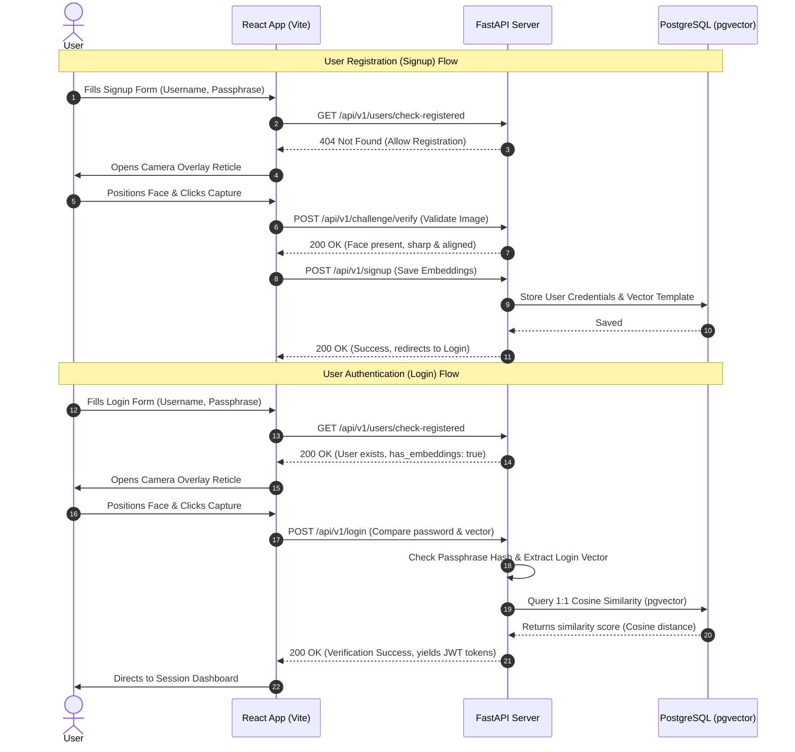

# BiometricGuard — High-Precision Face Authentication Platform

BiometricGuard is a production-ready, high-fidelity facial authentication system featuring a responsive frontend camera overlay, real-time validation checks, and vector similarity comparisons. It is built using **React**, **FastAPI**, **PostgreSQL**, **pgvector**, and **InsightFace (buffalo_l)**.

---

## 🏗️ System Architecture & Workflow

The platform handles user enrollment and login validation using a manual capture shutter workflow coupled with edge-case validation checks.



---

## 🌟 Core Features

1. **Self-Enrollment during Login**:
   - If an account exists in the database but has **0 face templates** enrolled, the frontend intercepts the login request, alerts the user, and launches the Guided Camera in enrollment mode. Once captured, the vectors are registered, and the user is logged in automatically.
2. **Robust Quality Validation (On-Click)**:
   - Evaluates frames for face presence (ignores background faces).
   - Validates face centering (maximum 20% deviation) and distance (bounding box area ratio).
   - Checks for brightness limits (50–230 range) and blur Laplacian variance (`MIN_BLUR = 15.0`) to reject fingers or covered lenses.
3. **Manual capture shutter button**:
   - Captures frames strictly on click, preventing unintended auto-captures of blurry movements or fingers.
4. **Modern UI Aesthetics**:
   - Sleek viewport vignette, tech corner brackets guide reticle, and dynamic scanning laser animations.

---

## 🛠️ Technology Stack

| Component | Technology | Description |
| :--- | :--- | :--- |
| **Frontend** | React (Vite) | High performance SPA dashboard |
| **Camera Interface** | React Webcam | Client-side camera feed handling |
| **Styling** | Vanilla CSS | Modern glassmorphic and dark mode styling |
| **Backend** | FastAPI | High-speed Python API framework |
| **Biometrics** | InsightFace (`buffalo_l`) | State-of-the-art face detection and embedding model |
| **Computer Vision** | OpenCV | Image decoding, resizing, and blur metrics |
| **Database** | PostgreSQL + pgvector | SQL database handling 512-dimension vector embedding comparisons |

---

## 📂 Repository Layout

```text
face_verification/
├── backend/
│   ├── main.py                     # FastAPI application router & endpoints
│   ├── models.py                   # SQLAlchemy ORM definitions (Users, Embeddings)
│   ├── schemas.py                  # Pydantic schemas (requests, responses)
│   ├── database.py                 # Session config and pgvector engine setups
│   ├── config.py                   # Environment thresholds (confidence, similarity limits)
│   └── services/
│       ├── camera_validation.py    # Face alignment and distance checks
│       ├── quality_service.py      # Brightness levels, blur variance, and scoring
│       ├── challenge_service.py    # Pose rotation and gesture checks
│       ├── embedding_service.py    # ONNX model inference & embedding generator
│       ├── matching_service.py     # 1:N duplicate check and 1:1 similarity search
│       └── jwt_service.py          # Native bcrypt hashing & token issuance
├── frontend/
│   ├── src/
│   │   ├── App.jsx                 # Credentials validator & UI coordinator
│   │   ├── components/
│   │   │   ├── AuthForm.jsx        # Login & signup inputs validation
│   │   │   └── GuidedCamera.jsx    # Shutter capture & HUD reticle overlay
│   │   ├── index.css               # Core styling tokens & scanner laser keyframes
│   │   └── main.jsx
│   ├── package.json
│   └── vite.config.js
├── docker-compose.yml              # DB, API, and Frontend orchestration script
└── README.md
```

---

## 🚀 Running Locally with Docker

Prerequisites: Make sure you have [Docker](https://www.docker.com/) installed and running.

1. **Clone and Navigate**:
   ```bash
   git clone https://github.com/Nerd78/face_verification.git
   cd face_verification
   ```

2. **Boot the Containers**:
   ```bash
   docker compose up -d --build
   ```
   *Note: On the first boot, the backend container will download the 270MB `buffalo_l` ONNX model weights and store them in the `insightface_cache` volume.*

3. **Port Access Layout**:
   - **Frontend**: [http://localhost:5173](http://localhost:5173)
   - **Backend API**: [http://localhost:8001](http://localhost:8001)
   - **PostgreSQL**: host port `5433` (maps internally to `5432` to avoid collisions)

---

## 🔌 API Endpoints Summary

| Endpoint | Method | Payload | Description |
| :--- | :--- | :--- | :--- |
| `/api/v1/users/check-registered` | `GET` | Query `username_or_email` | Verifies registration and biometrics presence status |
| `/api/v1/signup` | `POST` | `SignupRequest` (Base64 Frames) | Registers profile credentials and stores face embeddings |
| `/api/v1/login` | `POST` | `LoginRequest` (Passphrase + Frame) | Runs 1:1 verification and issues JWT access tokens |
| `/api/v1/users/enroll-face` | `POST` | `EnrollFaceRequest` | Sets up biometrics for registered users without face profiles |
| `/api/v1/challenge/verify` | `POST` | `BiometricChallengeCheck` | Validates frame sharpness, centering, and pose alignment |
